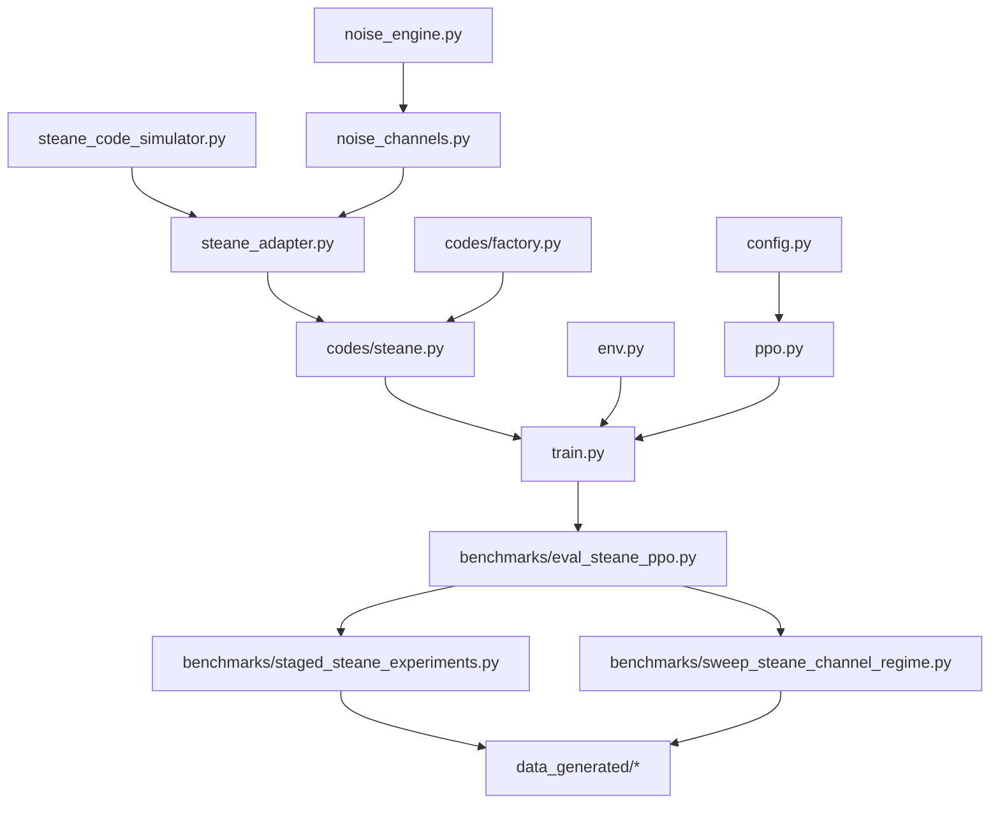
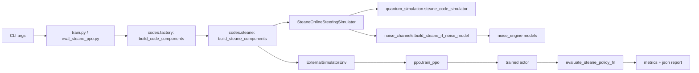
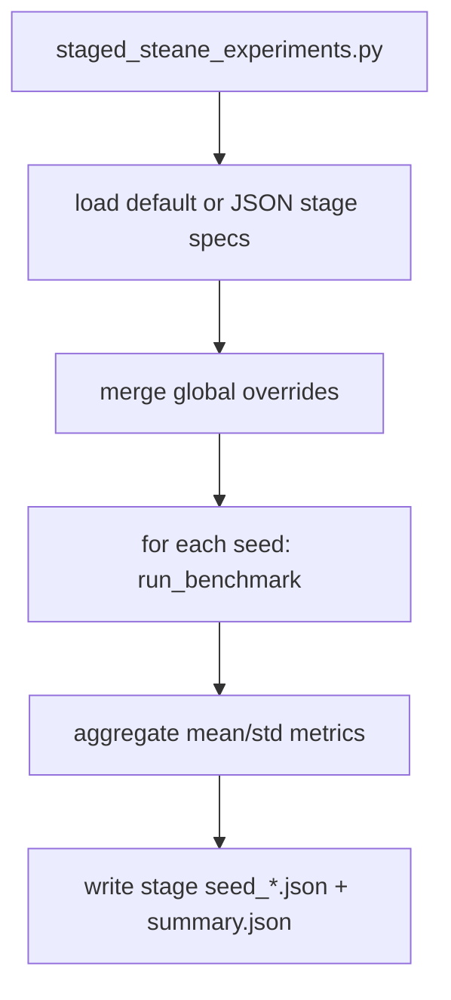
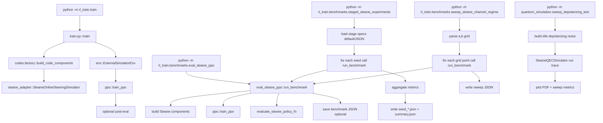
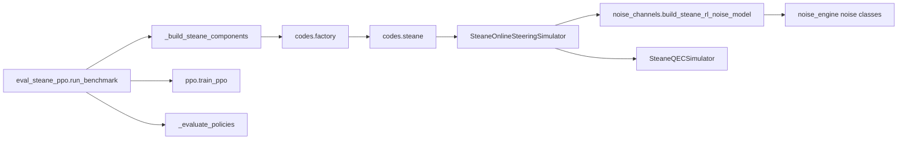

# RL_QEC_control_tuning Project Architecture

This document is a practical map of the codebase: folder layout, module dependency flow, and execution pipelines.

## 1. Scope

Current active pipeline focuses on:
- Steane-code simulation (`code/quantum_simulation`)
- RL training/evaluation/benchmarking (`code/rl_train`)
- Staged experiment outputs (`code/data_generated`)

Planned extension points already exist for:
- multi-code-family support (`code/rl_train/codes/*`)
- multi-noise-channel support (`code/quantum_simulation/noise_channels.py`)

## 2. Directory Layout (Key Files)

```text
RL_QEC_control_tuning/
├── PROJECT_ARCHITECTURE.md            # this file
├── README.md                          # top-level entry
├── result_analysis.md                 # experiment analysis notes/results
├── resources/                         # papers and reference material
├── code/
│   ├── quantum_simulation/
│   │   ├── steane_code_simulator.py   # Steane circuit simulation + experiment APIs
│   │   ├── noise_engine.py            # core noise model classes (Stim circuit injection)
│   │   ├── noise_channels.py          # noise-channel factory/registry used by RL
│   │   └── sweep_depolarizing_test.py # simulation-only noise sweep script
│   ├── rl_train/
│   │   ├── interfaces.py              # simulator/env interfaces and callback types
│   │   ├── env.py                     # ExternalSimulatorEnv wrapper
│   │   ├── config.py                  # PPOConfig dataclass
│   │   ├── ppo.py                     # PPO implementation
│   │   ├── steane_adapter.py          # Steane simulator adapter (reset/step protocol)
│   │   ├── train.py                   # training entrypoint
│   │   ├── codes/
│   │   │   ├── base.py                # CodeComponents bundle interface
│   │   │   ├── steane.py              # steane-specific builder
│   │   │   └── factory.py             # code-family dispatch
│   │   └── benchmarks/
│   │       ├── eval_steane_ppo.py     # one-shot train+eval benchmark
│   │       ├── staged_steane_experiments.py  # staged batch runner
│   │       ├── sweep_steane_channel_regime.py # channel regime grid sweep
│   │       └── examples/
│   │           └── stage_specs_parametric_regime.json
│   └── data_generated/                # generated benchmark/sweep outputs
└── notes.md
```

## 3. High-Level Dependency Graph



## 4. Pipeline: RL Train/Eval Flow



## 5. Pipeline: Staged Benchmark Flow



## 6. Noise Channel Dispatch (Current)

`quantum_simulation/noise_channels.py` is the single dispatch layer used by RL.

Supported channel keys:
- `auto`
- `google_global`
- `google_gate_specific`
- `idle_depolarizing`
- `parametric_google`
- `correlated_pauli_noise_channel`

Selection path:
1. CLI `--steane-noise-channel` from `train.py` / `eval_steane_ppo.py`
2. Stored in `SteaneAdapterConfig.noise_channel`
3. Resolved inside `build_steane_rl_noise_model(...)`
4. Concrete noise model object attached to `SteaneQECSimulator`

## 7. Extension Points (Recommended)

### 7.1 Add New Code Family
1. Add `code/rl_train/codes/<new_code>.py` with builder returning `CodeComponents`.
2. Register in `codes/factory.py`:
   - `available_code_families()`
   - `build_code_components()`
3. Reuse existing `train.py` / benchmark scripts via `--code-family <new_code>`.

### 7.2 Add New Noise Model
1. Implement channel builder in `quantum_simulation/noise_channels.py`.
2. Register key in:
   - `SteaneNoiseChannel`
   - `available_steane_noise_channels()`
   - `build_steane_rl_noise_model(...)`
3. Expose key in CLI choices in:
   - `rl_train/train.py`
   - `rl_train/benchmarks/eval_steane_ppo.py`

### 7.3 Replace Correlated Channel Physics
Edit only:
- `correlated_pauli_model_kernel(...)` in `quantum_simulation/noise_channels.py`

Keep contract:
- return `p_total(q,t)` in `[0, p_clip_max]`.

## 8. Data/Output Conventions

- Single benchmark run: JSON report from `eval_steane_ppo.py`
- Staged runs: per-stage folders with `seed_<id>.json` and global `summary.json`
- Sweep runs: grid-style JSON summaries

Primary generated root:
- `code/data_generated/`

## 9. Fast Orientation (for collaborators)

If you only read 5 files, read in this order:
1. `code/rl_train/benchmarks/eval_steane_ppo.py`
2. `code/rl_train/steane_adapter.py`
3. `code/quantum_simulation/noise_channels.py`
4. `code/quantum_simulation/steane_code_simulator.py`
5. `code/rl_train/benchmarks/staged_steane_experiments.py`

## 10. Command Entry Call Graph

### 10.1 Main command-to-module map



### 10.2 Runtime stack under `run_benchmark`



### 10.3 Output artifact mapping by command

- `train.py`:
  - terminal logs; optional post-eval summary in stdout
- `eval_steane_ppo.py`:
  - optional one-run report JSON via `--save-json`
- `staged_steane_experiments.py`:
  - per-stage `seed_<id>.json`
  - stage-group `summary.json`
- `sweep_steane_channel_regime.py`:
  - one sweep JSON report (grid + aggregate + runs)
- `sweep_depolarizing_test.py`:
  - sweep metrics and generated plot files
