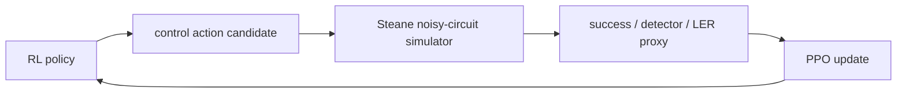
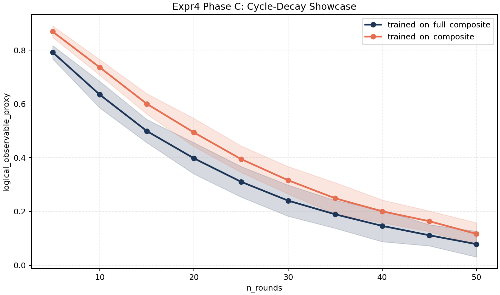

# RL_QEC_control_tuning

## Description

This repository studies reinforcement-learning-based control tuning for
quantum error correction, with a current focus on Steane-code memory
experiments under:

- Google-like gate noise
- correlated idle Pauli noise
- measurement-error overlays

The control loop is:

1. propose a gate-control action
2. run a noisy Steane memory experiment
3. evaluate success / detector / LER-style metrics
4. update the policy with PPO



The circuit-level picture is:


At the bottom of the figure, the effective per-step dynamics are:

```text
ρ_(j+1) = N_j(M_j(G_j(U_j(ρ_j))))
```

where:

- `U_j`: intended noiseless control operation
- `G_j`: RL-controlled gate-calibration layer
- `M_j`: measurement-error overlay
- `N_j`: stochastic noise channel, including correlated components

The main channel families used in the current experiments are:

```text
ρ_(j+1) = N_j^(gate)(U_j(ρ_j))
```

Google-like gate noise:

- depolarizing gate noise driven by control mismatch
- physical meaning: imperfect gate calibration and drift-sensitive control

```text
ρ_(j+1) = N_j^(corr-idle)(U_j(ρ_j))
```

Correlated idle noise:

- hidden-Markov / telegraph-like idle Pauli process with parameters `(f, g)`
- physical meaning:
  - `f`: temporal correlation rate
  - `g`: correlated idle-noise strength

```text
ρ_(j+1) = N_j^(corr-idle) ∘ N_j^(gate)(U_j(ρ_j))
```

Composite channel:

- gate noise plus correlated idle noise
- physical meaning: simultaneous calibration-sensitive gates and time-correlated idle errors

```text
ρ_(j+1) = M_j^(meas) ∘ N_j^(corr-idle) ∘ N_j^(gate)(U_j(ρ_j))
```

Full composite:

- composite channel plus measurement bit-flip overlay
- physical meaning: gate, idle, and readout-like errors together

## Methods

Core tools and implementation pieces:

- simulator backend:
  - [code/quantum_simulation/](./code/quantum_simulation/)
- RL training stack:
  - [code/rl_train/](./code/rl_train/)
- experiment driver:
  - [eval_steane_ppo.py](./code/rl_train/benchmarks/eval_steane_ppo.py)
- fixed-policy cycle sweep:
  - [eval_steane_cycle_sweep.py](./code/rl_train/benchmarks/eval_steane_cycle_sweep.py)

Methodologically, the current study uses:

- PPO for policy optimization
- Steane code memory experiments as the environment
- staged experiment design:
  - `Phase A`: quick scan
  - `Phase B`: focused comparison
  - `Phase C`: confirm

The main reported metrics are:

- `success_rate`
- `LER~ = 1 - success_rate`
- `improvement_vs_fixed_zero.ler_proxy`
- for memory-decay figures:
  - `logical_observable_proxy = 2 * success_rate - 1`

Detailed experiment outputs and scripts live in:

- [Experiment README](./code/data_generated/rl_Steane_tune_experiment/README.md)
- [Final Experiment Conclusion](./code/data_generated/rl_Steane_tune_experiment/artifacts/final_conclusion.md)

## Results

The strongest positive result is under standard composite noise:

- `Expr2 Phase C` best confirm condition: `f=1e3, g=1.6`
- improve(LER~): `+30.96% +- 14.36%`

The strongest negative result is from the final memory-decay study:

- final showcase condition: `p=0.01, f=1e2, g=1.6`
- `trained_on_composite` remains above `trained_on_full_composite`
- this remains true after a `20-seed` confirm run

One figure that captures the current project state:



Interpretation:

- RL clearly improves performance over the fixed-zero baseline under composite noise
- but measurement-aware training does not currently outperform composite-only training

## Conclusion

The current evidence supports the following claim:

- RL control tuning improves Steane-QEC performance under composite correlated noise

The current evidence does **not** support the stronger claim that:

- training on full composite noise with measurement overlay yields a better controller than training on composite noise alone

In other words:

- `Expr2` is a strong positive result
- `Expr3` is a qualified positive result
- `Expr4` is a stable negative result for the full-composite-advantage hypothesis

## Where To Look

- [PROJECT_ARCHITECTURE.md](./PROJECT_ARCHITECTURE.md)
- [Experiment README](./code/data_generated/rl_Steane_tune_experiment/README.md)
- [Final Experiment Conclusion](./code/data_generated/rl_Steane_tune_experiment/artifacts/final_conclusion.md)
