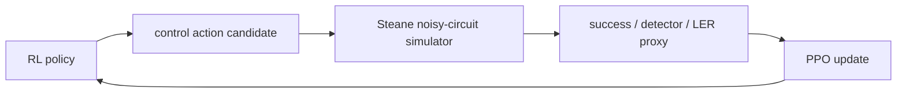
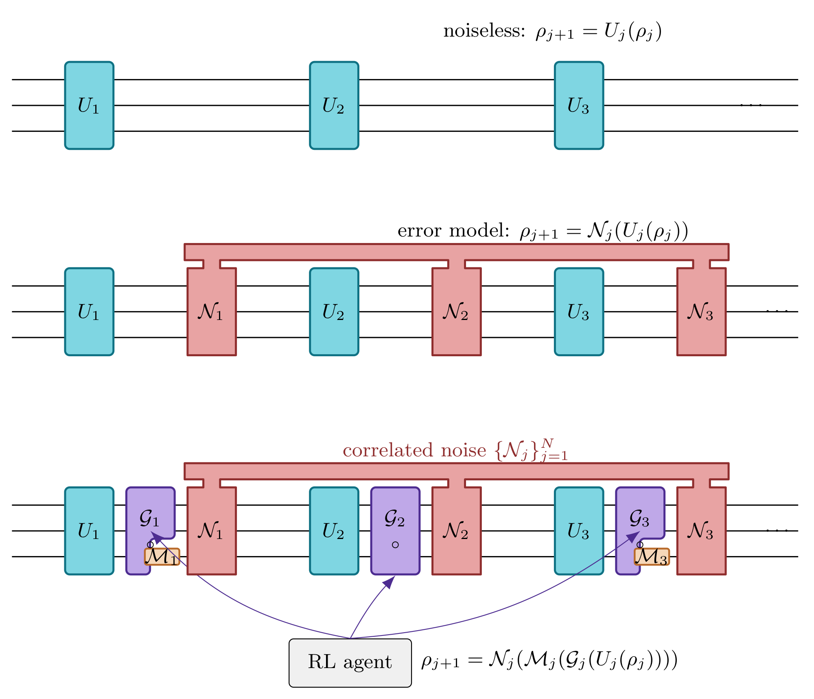
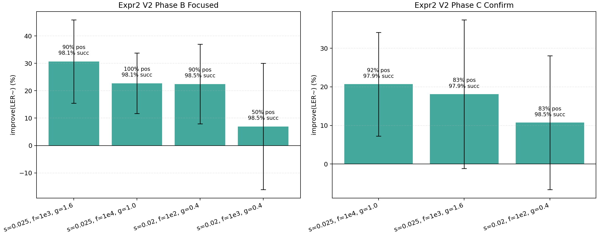
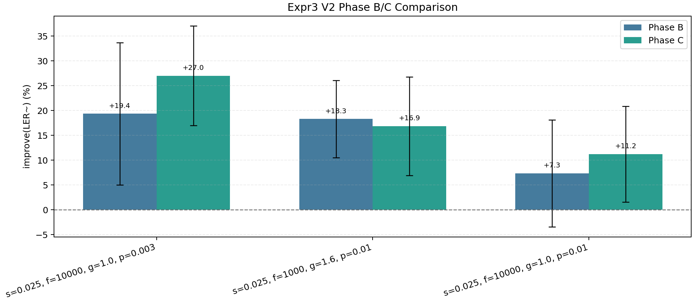
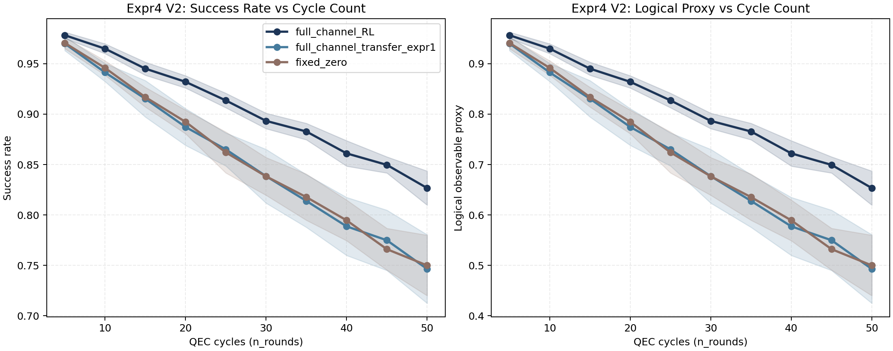

# RL_QEC_control_tuning

## Description

This repository studies reinforcement-learning-based control tuning for
quantum error correction, with a current focus on Steane-code memory
experiments under:

- Google-like gate noise
- correlated idle Pauli noise
- measurement-error overlays

The control loop is:

1. propose a gate-control action
2. run a noisy Steane memory experiment
3. evaluate success / detector / LER-style metrics
4. update the policy with PPO



The circuit-level picture is:



At the bottom of the figure, the effective per-step dynamics are:

```text
ρ_(j+1) = N_j(M_j(G_j(U_j(ρ_j))))
```

where:

- `U_j`: intended noiseless control operation
- `G_j`: RL-controlled gate-calibration layer
- `M_j`: measurement-error overlay
- `N_j`: stochastic noise channel, including correlated components

The main channel families used in the current experiments are:

```text
ρ_(j+1) = N_j^(gate)(U_j(ρ_j))
```

Google-like gate noise:

- depolarizing gate noise driven by control mismatch
- physical meaning: imperfect gate calibration and drift-sensitive control

```text
ρ_(j+1) = N_j^(corr-idle)(U_j(ρ_j))
```

Correlated idle noise:

- hidden-Markov / telegraph-like idle Pauli process with parameters `(f, g)`
- physical meaning:
  - `f`: temporal correlation rate
  - `g`: correlated idle-noise strength

```text
ρ_(j+1) = N_j^(corr-idle) ∘ N_j^(gate)(U_j(ρ_j))
```

Composite channel:

- gate noise plus correlated idle noise
- physical meaning: simultaneous calibration-sensitive gates and time-correlated idle errors

```text
ρ_(j+1) = M_j^(meas) ∘ N_j^(corr-idle) ∘ N_j^(gate)(U_j(ρ_j))
```

Full composite:

- composite channel plus measurement bit-flip overlay
- physical meaning: gate, idle, and readout-like errors together

## Methods

Core tools and implementation pieces:

- simulator backend:
  - [code/quantum_simulation/](./code/quantum_simulation/)
- RL training stack:
  - [code/rl_train/](./code/rl_train/)
- experiment driver:
  - [eval_steane_ppo.py](./code/rl_train/benchmarks/eval_steane_ppo.py)
- fixed-policy cycle sweep:
  - [eval_steane_cycle_sweep.py](./code/rl_train/benchmarks/eval_steane_cycle_sweep.py)

Methodologically, the current study uses:

- PPO for policy optimization
- Steane code memory experiments as the environment
- staged experiment design:
  - `Phase A`: quick scan
  - `Phase B`: focused comparison
  - `Phase C`: confirm

The main reported metrics are:

- `success_rate`
- `LER~ = 1 - success_rate`
- `improvement_vs_fixed_zero.ler_proxy`
- for memory-decay figures:
  - `logical_observable_proxy = 2 * success_rate - 1`

Detailed experiment outputs and scripts live in:

- [Experiment README](./code/data_generated/rl_Steane_tune_experiment/README.md)
- [Final Experiment Conclusion](./code/data_generated/rl_Steane_tune_experiment/artifacts/final_conclusion.md)

## V2 Results

The current canonical results are under:

- [V2 experiment README](./code/data_generated/rl_steane_tune_experiments_V2/README.md)

The V2 story is:

- `Expr1`: recalibrate the gate-only regime and lock in a stronger PPO recipe
- `Expr2`: show RL-positive gains under balanced gate-plus-correlated composite noise
- `Expr3`: show those gains survive after adding measurement bit-flip noise
- `Expr4`: show the full-channel advantage persists in long cycle-decay sweeps

### Headline Findings

`Expr2 V2` best confirmed composite point:

- `scale=0.025, f=1e4, g=1.0`
- `improve(LER~) = +20.70% +- 13.44%`

`Expr3 V2` best confirmed full-composite point:

- `scale=0.025, f=1e4, g=1.0, p_meas=3e-3`
- `improve(LER~) = +27.03% +- 10.03%`

`Expr4 V2` final cycle-decay confirm on the same full channel:

- `n_rounds=50`
  - `full_channel_RL = 82.67% +- 1.69%`
  - `full_channel_transfer_expr1 = 74.64% +- 3.40%`
  - `fixed_zero = 74.99% +- 3.00%`

Working interpretation:

- RL remains effective after adding correlated noise
- the advantage survives after adding measurement noise
- at long cycle depth, full-channel RL stays clearly above both `Expr1`
  transfer and `fixed_zero`

### Main Figures

Composite-noise benchmark:



Full-composite benchmark with measurement noise:



Long-cycle full-channel memory decay:



### Transfer Checks

Two transfer checks are part of the V2 evidence chain:

- `Expr1 -> Expr2` transfer does not explain the composite-noise gains
- `Expr1 -> Expr3` transfer does not explain the full-composite gains

This is why the V2 conclusion is framed as:

- RL learns additional adaptation to the composite / full-composite environment

rather than:

- RL simply reuses a gate-only policy learned in `Expr1`

## Conclusion

The current V2 evidence supports the following claim:

- RL control tuning improves Steane-QEC performance under calibrated composite
  and full-composite noise models

The strongest V2 long-cycle claim is:

- full-channel RL retains a clear advantage over both `Expr1` transfer and
  `fixed_zero` in the final `Expr4 V2` cycle sweep

## Where To Look

- [PROJECT_ARCHITECTURE.md](./PROJECT_ARCHITECTURE.md)
- [V2 experiment README](./code/data_generated/rl_steane_tune_experiments_V2/README.md)
- [Expr2 recap](./code/data_generated/rl_steane_tune_experiments_V2/expr2_standard_composite_v2/expr2_v2_recap.md)
- [Expr3 recap](./code/data_generated/rl_steane_tune_experiments_V2/expr3_full_composite_v2/expr3_v2_recap.md)
- [Expr4 Phase C summary](./code/data_generated/rl_steane_tune_experiments_V2/expr4_cycle_decay_full_composite_v2/phaseC_confirm/summary.md)
